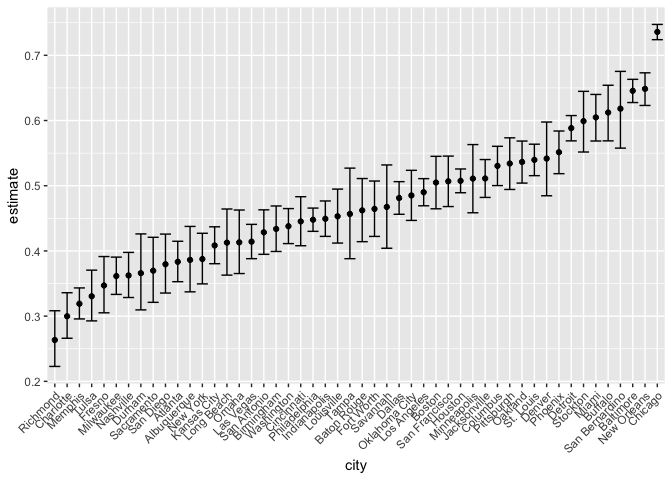
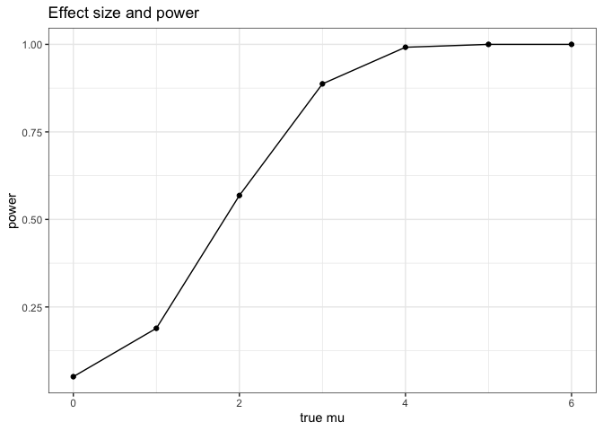
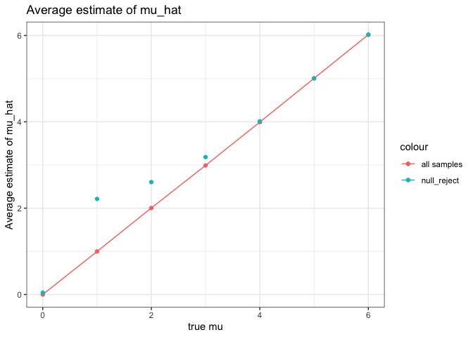

p8105_hw5_mf3593
================
Miao Fu
2023-11-07

### Problem 1

``` r
Homicide_df=read.csv("homicide-data.csv")|>
  janitor::clean_names()|>
  mutate(city_state=paste0(city,",",state))

homicide_unsolved=Homicide_df|>
  mutate(
    homicide=ifelse(disposition%in%c("Closed without arrest","Open/No arrest"),"unsolved homicides","solved homicides")
  )|>
  group_by(city,homicide)|>
  summarise(unsolved=n())|>
  filter(homicide=="unsolved homicides")

homicide_count=Homicide_df|>
  group_by(city)|>
  summarise(total=n())|>
  full_join(homicide_unsolved,by="city")|>
  select(-homicide)

homicide_count|>
  filter(city=="Baltimore")|>
  knitr::kable()
```

| city      | total | unsolved |
|:----------|------:|---------:|
| Baltimore |  2827 |     1825 |

``` r
baltimore=prop.test(x=1825,n=2827)|>
  broom::tidy()|>
  select(estimate,conf.low,conf.high)

knitr::kable(baltimore)
```

|  estimate |  conf.low | conf.high |
|----------:|----------:|----------:|
| 0.6455607 | 0.6275625 | 0.6631599 |

``` r
all_city=purrr::map2(homicide_count$unsolved,homicide_count$total,prop.test)
for (i in 1:50) {
  all_city[[i]]=broom::tidy(all_city[[i]])|>
  select(estimate,conf.low,conf.high)
}
all_city_df=bind_rows(all_city)|>
  cbind(homicide_count)|>
  select(city,estimate,conf.low,conf.high)

all_city_df|>
  mutate(city=fct_reorder(city,estimate))|>
  ggplot(aes(x=city,y=estimate))+
  geom_point(stat="identity")+
  geom_errorbar(aes(ymin=conf.low,ymax=conf.high))+
  theme(axis.text.x=element_text(angle=45,hjust=1))
```

<!-- -->

The raw data has 52179 rows and 13 columns. It contains the following
variables: uid, reported_date, victim_last, victim_first, victim_race,
victim_age, victim_sex, city, state, lat, lon, disposition, city_state.
It gives information about different types of homicides happened across
50 large U.S. cities from 2010 to 2016.

### Problem 2

``` r
file_names=as.list(list.files("data"))|>
  lapply(function(x)paste0("data/",x))
files=tibble(file_name=file_names)

read_data=function(file){
  data=read.csv(file)
  return(data)
}


files=files|>
  mutate(data=purrr::map(file_names,read_data),
         file_name=ifelse(grepl("con",pull(files,file_name)),paste0("control ",substring(file_name,10,11)),paste0("experiment ",substring(file_name,10,11))
  ))|>
  unnest(data)|>
  janitor::clean_names()|>
  rename(subject=file_name)|>
  separate(subject,into=c("group","ID"),sep=" ")

files|>pivot_longer(
    week_1:week_8,
    names_to="visit",
    names_prefix="week_",
    values_to="data"
  )|>
  mutate(visit=as.numeric(visit))|>
  ggplot(aes(x=visit,y=data,color=group))+
  geom_line()+
  facet_grid(~ID)+
  theme(legend.position="bottom")+
  labs(
    title="Experiment Data",
    x="Visit(weeks)",
    y="Data Value",
    color="Subject Group"
  )
```

<!-- -->

According to the plots, experiment group subjects have higher data
values than control arm subjects.

### Problem 3

``` r
set.seed(1)

sim_mean_p=function(samp_size=30,mu,sigma=5) {

  x=rnorm(n=samp_size,mean=mu,sd=sigma)
  result=t.test(x,mu=0,conf.level=0.95)|>
    broom::tidy()
  
  return(tibble(mu_hat=pull(result,estimate),
         p_value=pull(result,p.value),
          mu_value=mu))
}

output2=vector("list",35000)
main_output=vector("list",7)

for (a in 0:6){
  for (i in 1:5000) {
  output2[[i]]=sim_mean_p(mu=a)
  }
  main_output[[a+1]]=bind_rows(output2)
}
sim_results_2=bind_rows(main_output)

sim_results_2|>
  mutate(null=as.numeric(p_value<0.05))|>
  group_by(mu_value)|>
  summarise(ratio=sum(null)/n())|>
  ggplot(aes(x=mu_value,y=ratio))+
  geom_point()+
  geom_line()+
  labs(
    title="Effect size and power",
    x="true mu",
    y="power"
  )+
  theme_bw()
```

<!-- -->

Power increases as the effect size(true mu) increases and approximates
to 1 at 6.

``` r
results_reject=sim_results_2|>
  filter(p_value<0.05)|>
  group_by(mu_value)|>
  summarise(avg=mean(mu_hat))
  
sim_results_2|>
  group_by(mu_value)|>
  summarise(avg=mean(mu_hat))|>
  ggplot(aes(x=mu_value,y=avg,color="all samples"))+
  geom_point()+
  geom_line()+
  geom_point(data=results_reject,aes(y=avg,color="null_reject"))+
  labs(
    title="Average estimate of mu_hat",
    x="true mu",
    y="Average estimate of mu_hat"
  )+
  theme_bw()
```

<!-- -->

The sample average of $\hat{\mu}$ across tests for which the null is
rejected is still approximately equal to the true value of $\mu$. This
is because we have large sample size and according to CLT, the mean of
sample distribution will approximate the true mean.
